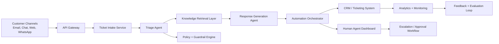

# System Architecture

## High-Level Design

## Layers

### 1. Channel Layer
- Email, chat, help center, WhatsApp, social, web forms
- Ingests customer conversations and support requests

### 2. API and Orchestration Layer
- Handles validation, auth, queueing, and workflow orchestration
- Coordinates agents and services in sequence

### 3. AI Agent Layer
- Intake, triage, response, escalation, and agent-assist agents
- Uses LLMs with structured outputs and rules

### 4. Retrieval and Knowledge Layer
- Stores FAQs, product documents, troubleshooting guides, and policies
- Uses embeddings and semantic search for answer retrieval

### 5. Workflow and Automation Layer
- Routes cases, schedules follow-ups, and updates ticket state
- Integrates with CRM and support systems

### 6. Guardrails and Policy Layer
- Checks for compliance, risk, fraud, and unsupported actions
- Blocks unsafe or unsupported responses

### 7. Data and Monitoring Layer
- Stores ticket metadata, audit logs, traces, utilization, and SLA metrics
- Enables debugging and model evaluation

## Key Components

- Support portal
- Ticketing database
- Vector database
- LLM gateway
- Workflow engine
- Notifications service
- Knowledge base indexer
- Evaluation dashboard
- Human review console

## Data Flow

1. Customer submits a ticket.
2. System normalizes and stores the incoming request.
3. Triage agent identifies category and urgency.
4. Knowledge agent retrieves relevant policy and issue context.
5. Response agent drafts a reply or action.
6. Guardrails validate compliance and safety.
7. Approved messages are sent, or the case is escalated.
8. Feedback and outcomes are stored for evaluation and retraining.

## Production Considerations

- Rate limits and retries for LLM calls
- PII detection and data minimization
- Redaction of sensitive information before processing
- Human approval for refunds, legal issues, account access risks, and fraud
- Audit logs for every decision and outbound message
- Clear tracking of SLA and case ownership

## MVP

- AI intake and ticket tagging
- FAQ response generation with RAG
- Smart routing and escalation
- Human-in-the-loop review
- Basic monitoring dashboard

## Production Roadmap

- Multi-channel orchestration
- Advanced sentiment and urgency scoring
- Agent assist suggestions
- Prompt optimization and A/B testing
- Continuous evaluation and model tuning
